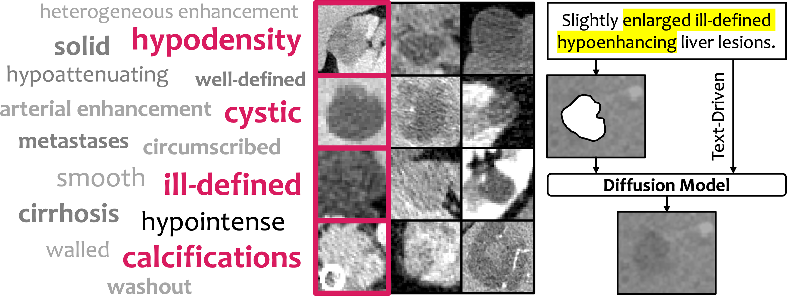

<h1 align="center">TextoMorph</h1>

<div align="center">


[](https://github.com/MrGiovanni/TextoMorph/stargazers)
<a href="https://twitter.com/bodymaps317">
        
</a><br/>
**Subscribe us: https://groups.google.com/u/2/g/bodymaps**  

</div>

<p align="center"></p>

We introduce TextoMorph, a novel text-driven approach that allows textual control over tumor features such as texture, heterogeneity, boundaries, and pathology type to improve AI training. The text is extracted from medical reports (e.g., radiology/pathology reports).

## Paper

<b>Text-Driven Tumor Synthesis</b> <br/>
[Xinran Li](https://scholar.google.com/citations?hl=zh-CN&user=awRZX_gAAAAJ)<sup>1,2</sup>, [Yi Shuai](https://openreview.net/profile?id=~Yi_Shuai1)<sup>3,4</sup>, [Chen Liu](https://scholar.google.com/citations?user=i938yiEAAAAJ&hl=zh-CN)<sup>1,5</sup>, [Qi Chen](https://scholar.google.com/citations?user=4Q5gs2MAAAAJ&hl=en)<sup>1,6</sup>, [Qilong Wu](https://github.com/JerryWu-code)<sup>1,7</sup>, [Pengfei Guo](https://scholar.google.co.uk/citations?hl=en&pli=1&user=_IAp-bYAAAAJ)<sup>8</sup>, [Dong Yang](https://scholar.google.com/citations?user=PHvliUgAAAAJ&hl=en&oi=sra)<sup>8</sup>, [Can Zhao](https://scholar.google.com/citations?user=CdzhxtYAAAAJ&hl=en)<sup>8</sup>, [Pedro R. A. S. Bassi](https://scholar.google.com/citations?hl=zh-CN&user=NftgL6gAAAAJ)<sup>1,9,10</sup>, [Daguang Xu](https://research.nvidia.com/person/daguang-xu)<sup>8</sup>, [Kang Wang](https://radiology.ucsf.edu/people/kang-wang)<sup>11</sup>, [Yang Yang](https://scholar.google.com/citations?user=6XsJUBIAAAAJ&hl=zh-CN)<sup>11</sup>, [Alan Yuille](https://www.cs.jhu.edu/~ayuille/)<sup>1</sup>, [Zongwei Zhou](https://www.zongweiz.com/)<sup>1,*</sup> <br/>
<sup>1</sup> Johns Hopkins University  
<sup>2</sup> Shenzhen Technology University  <sup>3</sup> The First Affiliated Hospital of Sun Yat-sen University   
<sup>4</sup> Sun Yat-sen University  <sup>5</sup> Hong Kong Polytechnic University  
<sup>6</sup> University of Chinese Academy of Sciences  <sup>7</sup> National University of Singapore  
<sup>8</sup> NVIDIA  <sup>9</sup> University of Bologna  <sup>10</sup> Italian Institute of Technology  <sup>11</sup> University of California, San Francisco <br/>
<a href='https://arxiv.org/pdf/2412.18589'></a>

**We collect paper related to medical data synthesis in [Awesome Synthetic Tumors](https://github.com/MrGiovanni/SyntheticTumors/blob/main/AWESOME.md) [](https://awesome.re)**


## 0. Installation

```bash
git clone https://github.com/MrGiovanni/TextoMorph.git
cd TextoMorph
```
See [installation](utils/INSTALL.md) to obtain requirements and download dataset.


## 1. Train Text-Driven Diffusion Model

> [!NOTE]
> **TL;DR:** We provide pre-trained Diffusion Models for liver, pancreas, and kidney, which can be directly used for tumor synthesis. Download them to `Segmentation/TumorGeneration/model_weight`

| Tumor      | Download                                                                                      |
|------------|-----------------------------------------------------------------------------------------------|
| **Liver**  | [Download](https://huggingface.co/Alena-Xinran/DescriptiveTumor/resolve/main/descriptivetumor2/liver.pt) |
| **Pancreas** | [Download](https://huggingface.co/Alena-Xinran/DescriptiveTumor/resolve/main/descriptivetumor2/pancreas.pt) |
| **Kidney**   | [Download](https://huggingface.co/Alena-Xinran/DescriptiveTumor/resolve/main/descriptivetumor2/kidney.pt?download=true) |


#### 1.1 Download Pre-Trained Autoencoder
Our **Autoencoder Model** was trained on the [AbdomenAtlas 1.1](https://github.com/MrGiovanni/SuPreM) dataset. This checkpoint can be directly used for Diffusion Model. Download it to `Diffusion/pretrained_models/`:

```bash
cd Diffusion/pretrained_models
wget https://huggingface.co/MrGiovanni/DiffTumor/resolve/main/AutoencoderModel/AutoencoderModel.ckpt
cd ../..
```
#### 1.2 Extract Descriptive Words from Reports

Due to licensing constraints, we are unable to provide the training CT datasets. However, to assist in training your own model, we have made the **descriptive words** used during training available in the following files:

- [📁 liver](https://github.com/MrGiovanni/TextoMorph/tree/main/Diffusion/cross_eval/liver/real_tumor.txt)
- [📁 pancreas](https://github.com/MrGiovanni/TextoMorph/tree/main/Diffusion/cross_eval/pancreas/real_tumor.txt)
- [📁 kidney](https://github.com/MrGiovanni/TextoMorph/tree/main/Diffusion/cross_eval/kidney/real_tumor.txt)

If you wish to train your own model, you can rewrite these `real_tumor.txt` files using the following format:

```plaintext
CT_id  Label_id  t1  t2  ...  t100
```

#### 1.3 Start Training

```bash
cd Diffusion/
vqgan_ckpt="pretrained_models/AutoencoderModel.ckpt" # your-datapath
datapath="/ccvl/net/ccvl15/xinran/CT/" # your-datapath
tumorlabel="/ccvl/net/ccvl15/xinran/Tumor/liver/" # your-datapath
python train.py dataset.name=liver_tumor dataset.data_root_path=$datapath dataset.label_root_path=$tumorlabel dataset.dataset_list=['liver'] dataset.uniform_sample=False model.results_folder_postfix="liver"  model.vqgan_ckpt=$vqgan_ckpt
```

## 2. Train Segmentation Model

> [!NOTE]
> **TL;DR:** We provide Segmentation Models for liver, pancreas, and kidney, which can be directly used for tumor segmentation.
> [Download all checkpoints](https://huggingface.co/Alena-Xinran/DescriptiveTumor/resolve/main/checkpoints.zip?download=true)

<details>
<summary>Liver Tumor Segmentation</summary>

| **Method**       | **Tumor Size (mm) d < 20** | **20 ≤ d < 50** | **d ≥ 50** | **DSC (%)**    | **NSD (%)**    |
|------------------|--------------------------|------------------------|-------------------|----------------|----------------|
| RealTumor <br /> ([checkpoint](https://huggingface.co/Alena-Xinran/DescriptiveTumor/resolve/main/baseline/real/liver.pt))        | 64.5 (20/31)            | 69.7 (53/76)          | 66.7 (38/57)      | 59.1 ± 30.4    | 60.1 ± 30.0    |
| SynTumor <br /> ([paper](https://arxiv.org/pdf/2303.14869), [checkpoint](https://huggingface.co/Alena-Xinran/DescriptiveTumor/resolve/main/baseline/syntumor/liver.pt))         | 71.0 (22/31)            | 69.7 (53/76)          | 73.7 (42/57)      | 62.3 ± 12.7    | 87.7 ± 21.4    |
| Pixel2Cancer <br /> ([paper](https://www.cs.jhu.edu/~alanlab/Pubs24/lai2024pixel.pdf), [checkpoint](https://huggingface.co/Alena-Xinran/DescriptiveTumor/resolve/main/baseline/pixel2cance/liver.pt))     | -                        | -                      | -                 | 57.2 ± 21.3    | 63.1 ± 15.6    |
| DiffTumor <br /> ([paper](https://www.cs.jhu.edu/~alanlab/Pubs24/chen2024towards.pdf), [checkpoint](https://huggingface.co/Alena-Xinran/DescriptiveTumor/resolve/main/baseline/difftumor/liver.pt))        | 77.4 (24/31)            | 75.0 (57/76)          | 73.7 (42/57)      | 64.2 ± 33.3    | 66.1 ± 32.8    |
| TextoMorph (1) <br /> ([checkpoint](https://huggingface.co/Alena-Xinran/DescriptiveTumor/resolve/main/segmentation1/liver.pt))  | 75.4 (23/31)            | 72.4 (55/76)          | 74.6 (43/57)      | 65.5 ± 25.0    | 61.3 ± 28.6    |
| TextoMorph (2) <br /> ([checkpoint](https://huggingface.co/Alena-Xinran/DescriptiveTumor/resolve/main/segmentation2/liver.pt))  | 77.4 (24/31)            | 75.0 (57/76)          | 77.2 (44/57)      | 68.4 ± 30.4    | 69.2 ± 31.0    |
| TextoMorph (3) <br /> ([checkpoint](https://huggingface.co/Alena-Xinran/DescriptiveTumor/resolve/main/segmentation3/liver.pt))  | 80.6 (25/31)            | 77.6 (59/76)          | 80.7 (46/57)      | 69.7 ± 27.2    | 70.8 ± 26.0    |
| TextoMorph (4) <br /> ([checkpoint](https://huggingface.co/Alena-Xinran/DescriptiveTumor/resolve/main/segmentation/liver.pt))  | 83.9 (26/31)            | 77.6 (59/76)          | 87.7 (50/57)      | 71.6 ± 27.2    | 72.4 ± 30.3    |

</details>

<details>
<summary>Pancreas Tumor Segmentation</summary>

| **Method**       | **Tumor Size (mm) d < 20** | **20 ≤ d < 50** | **d ≥ 50** | **DSC (%)**    | **NSD (%)**    |
|------------------|--------------------------|------------------------|-------------------|----------------|----------------|
| RealTumor   <br /> ([checkpoint](https://huggingface.co/Alena-Xinran/DescriptiveTumor/resolve/main/baseline/real/pancreas.pt))      | 58.3 (14/24)            | 67.7 (21/31)          | 57.1 (4/7)        | 53.3 ± 28.7    | 40.1 ± 28.8    |
| SynTumor    <br /> ([paper](https://arxiv.org/pdf/2303.14869), [checkpoint](https://huggingface.co/Alena-Xinran/DescriptiveTumor/resolve/main/baseline/syntumor/pancreas.pt))       | 62.5 (15/24)            | 64.5 (20/31)          | 57.1 (4/7)        | 54.0 ± 31.4    | 47.2 ± 23.0    |
| Pixel2Cancer   <br /> ([paper](https://www.cs.jhu.edu/~alanlab/Pubs24/lai2024pixel.pdf), [checkpoint](https://huggingface.co/Alena-Xinran/DescriptiveTumor/resolve/main/baseline/pixel2cance/pancreas.pt))     | -                        | -                      | -                 | 57.9 ± 13.7    | 54.3 ± 19.2    |
| DiffTumor   <br /> ([paper](https://www.cs.jhu.edu/~alanlab/Pubs24/chen2024towards.pdf), [checkpoint](https://huggingface.co/Alena-Xinran/DescriptiveTumor/resolve/main/baseline/difftumor/pancreas.pt))         | 66.7 (16/24)            | 67.7 (21/31)          | 57.1 (4/7)        | 58.9 ± 42.8    | 52.8 ± 26.2    |
| TextoMorph (1) <br /> ([checkpoint](https://huggingface.co/Alena-Xinran/DescriptiveTumor/resolve/main/segmentation1/pancreas.pt))   | 66.7 (16/24)            | 64.5 (20/31)          | 57.1 (4/7)        | 55.8 ± 32.6    | 51.1 ± 35.6    |
| TextoMorph (2) <br /> ([checkpoint](https://huggingface.co/Alena-Xinran/DescriptiveTumor/resolve/main/segmentation2/pancreas.pt))  | 70.8 (17/24)            | 61.3 (19/31)          | 57.1 (4/7)        | 59.7 ± 36.1    | 60.6 ± 38.3    |
| TextoMorph (3) <br /> ([checkpoint](https://huggingface.co/Alena-Xinran/DescriptiveTumor/resolve/main/segmentation3/pancreas.pt))  | 64.0 (16/24)            | 70.0 (21/31)          | 57.1 (4/7)        | 60.2 ± 27.3    | 71.0 ± 31.5    |
| TextoMorph (4) <br /> ([checkpoint](https://huggingface.co/Alena-Xinran/DescriptiveTumor/resolve/main/segmentation/pancreas.pt))  | 87.5 (21/24)            | 87.1 (27/31)          | 85.7 (6/7)        | 67.3 ± 24.8    | 65.5 ± 27.1    |
</details>


<details>
<summary>Kidney Tumor Segmentation</summary>
      
| **Method**       | **Tumor Size (mm) d < 20** | **20 ≤ d < 50** | **d ≥ 50** | **DSC (%)**    | **NSD (%)**    |
|------------------|--------------------------|------------------------|-------------------|----------------|----------------|
| RealTumor <br /> ([checkpoint](https://huggingface.co/Alena-Xinran/DescriptiveTumor/resolve/main/baseline/real/kidney.pt))        | 71.4 (5/7)             | 66.7 (4/6)           | 69.0 (29/42)      | 78.0 ± 14.9    | 65.8 ± 17.7    |
| SynTumor  <br /> ([paper](https://arxiv.org/pdf/2303.14869), [checkpoint](https://huggingface.co/Alena-Xinran/DescriptiveTumor/resolve/main/baseline/syntumor/kidney.pt))        | 71.4 (5/7)             | 66.7 (4/6)           | 69.0 (29/42)      | 78.1 ± 23.0    | 66.0 ± 21.2    |
| Pixel2Cancer <br /> ([paper](https://www.cs.jhu.edu/~alanlab/Pubs24/lai2024pixel.pdf), [checkpoint](https://huggingface.co/Alena-Xinran/DescriptiveTumor/resolve/main/baseline/pixel2cance/kidney.pt))    | -                        | -                      | -                 | 71.5 ± 21.4    | 64.3 ± 16.9    |
| DiffTumor <br /> ([paper](https://www.cs.jhu.edu/~alanlab/Pubs24/chen2024towards.pdf), [checkpoint](https://huggingface.co/Alena-Xinran/DescriptiveTumor/resolve/main/baseline/difftumor/kidney.pt))       | 71.4 (5/7)             | 83.3 (5/6)           | 69.0 (29/42)      | 78.9 ± 19.7    | 69.2 ± 18.5    |
| TextoMorph (1) <br /> ([checkpoint](https://huggingface.co/Alena-Xinran/DescriptiveTumor/resolve/main/segmentation1/kidney.pt))  | 57.1 (4/7)             | 83.3 (5/6)           | 69.0 (29/42)      | 79.2 ± 22.3    | 71.4 ± 21.4    |
| TextoMorph (2) <br /> ([checkpoint](https://huggingface.co/Alena-Xinran/DescriptiveTumor/resolve/main/segmentation2/kidney.pt))  | 71.4 (5/7)             | 83.3 (5/6)           | 76.2 (32/42)      | 80.6 ± 21.8    | 76.8 ± 19.3    |
| TextoMorph (3) <br /> ([checkpoint](https://huggingface.co/Alena-Xinran/DescriptiveTumor/resolve/main/segmentation3/kidney.pt))  | 71.4 (5/7)             | 83.3 (5/6)           | 73.8 (31/42)      | 79.7 ± 20.2    | 75.2 ± 21.5    |
| TextoMorph (4) <br /> ([checkpoint](https://huggingface.co/Alena-Xinran/DescriptiveTumor/resolve/main/segmentation/kidney.pt))  | 71.4 (5/7)             | 83.3 (5/6)           | 76.2 (32/42)      | 85.2 ± 9.7     | 78.4 ± 13.9    |
</details>


> [!NOTE]
> - TextoMorph (1): Without Text Extraction and Generation, Text-Driven Contrastive Learning, and Targeted Data Augmentation.
> - TextoMorph (2): With Text Extraction and Generation only.
> - TextoMorph (3): With Text Extraction and Generation and Text-Driven Contrastive Learning.
> - TextoMorph (4): With Text Extraction and Generation, Text-Driven Contrastive Learning, and Targeted Data Augmentation.

#### 2.1 Download Text-Driven Diffusion Models (from Step 1)

```bash

cd Segmentation/TumorGeneration/model_weight
wget https://huggingface.co/MrGiovanni/DiffTumor/resolve/main/AutoencoderModel/AutoencoderModel.ckpt

wget https://huggingface.co/Alena-Xinran/DescriptiveTumor/resolve/main/descriptivetumor2/liver.pt
wget https://huggingface.co/Alena-Xinran/DescriptiveTumor/resolve/main/descriptivetumor2/pancreas.pt
wget https://huggingface.co/Alena-Xinran/DescriptiveTumor/resolve/main/descriptivetumor2/kidney.pt

cd ../..
```
#### 2.2 Start Training
```bash
cd Segmentation

healthy_datapath="/ccvl/net/ccvl15/xinran/" # your-datapath
datapath="/ccvl/net/ccvl15/xinran/" # your-datapath
cache_rate=1.0
batch_size=12
val_every=50
workers=12
organ=liver
fold=0
backbone=unet
logdir="runs/$organ.fold$fold.$backbone"
datafold_dir=cross_eval/"$organ"_aug_data_fold/
dist=$((RANDOM % 99999 + 10000))
python -W ignore main.py --model_name $backbone --cache_rate $cache_rate --dist-url=tcp://127.0.0.1:$dist --workers $workers --max_epochs 2000 --val_every $val_every --batch_size=$batch_size --save_checkpoint --distributed --noamp --organ_type $organ --organ_model $organ --tumor_type tumor --fold $fold --ddim_ts 50 --logdir=$logdir --healthy_data_root $healthy_datapath --data_root $datapath --datafold_dir $datafold_dir
```

## 3. Evaluation

```bash
cd Segmentation
datapath="/ccvl/net/ccvl15/xinran/" #your-datapath
organ=liver
fold=0
datafold_dir=cross_eval/"$organ"_aug_data_fold/
python -W ignore validation.py --model=unet --data_root $datapath --datafold_dir $datafold_dir --tumor_type tumor --organ_type $organ --fold $fold --log_dir $organ/$organ.fold$fold.unet --save_dir out/$organ/$organ.fold$fold.unet
```

## Citation

```
@article{li2024text,
  title={Text-Driven Tumor Synthesis},
  author={Li, Xinran and Shuai, Yi and Liu, Chen and Chen, Qi and Wu, Qilong and Guo, Pengfei and Yang, Dong and Zhao, Can and Bassi, Pedro RAS and Xu, Daguang and others},
  journal={arXiv preprint arXiv:2412.18589},
  year={2024},
  url={https://github.com/MrGiovanni/TextoMorph}
}

@article{chen2024analyzing,
  title={Analyzing Tumors by Synthesis},
  author={Chen, Qi and Lai, Yuxiang and Chen, Xiaoxi and Hu, Qixin and Yuille, Alan and Zhou, Zongwei},
  journal={arXiv preprint arXiv:2409.06035},
  year={2024}
}

@inproceedings{chen2024towards,
  title={Towards Generalizable Tumor Synthesis},
  author={Chen, Qi and Chen, Xiaoxi and Song, Haorui and Xiong, Zhiwei and Yuille, Alan and Wei, Chen and Zhou, Zongwei},
  booktitle={IEEE/CVF Conference on Computer Vision and Pattern Recognition},
  year={2024},
  url={https://github.com/MrGiovanni/DiffTumor}
}
```

## Acknowledgments
This work was supported by the Lustgarten Foundation for Pancreatic Cancer Research and the Patrick J. McGovern Foundation Award.
